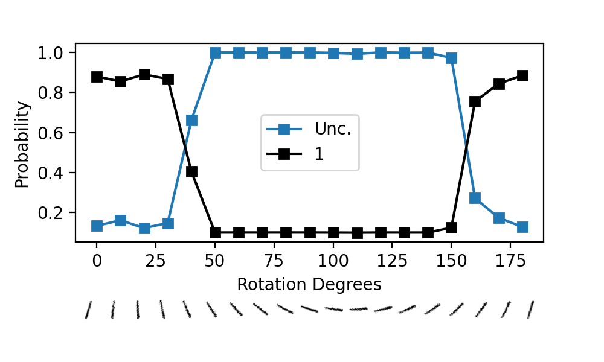
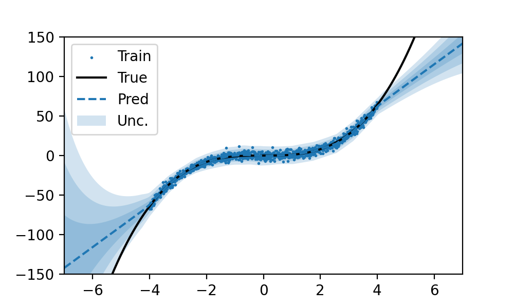

</img></img>

## Evidential Deep Learning in PyTorch

Implementation of [Evidential Deep Learning to Quantify Classification
Uncertainty](https://arxiv.org/abs/1806.01768) and [Deep Evidential
Regression](https://arxiv.org/abs/1910.02600), a deterministic method for
quantifying uncertainty for neural network models.

## Install

```bash
pip install edl_pytorch
```

## Usage

See [examples/mnist.py](examples/mnist.py) and
[examples/cubic.py](examples/cubic.py) for examples of classification/regression
respectively, producing the figures above.

For classification, use the `Dirichlet` layer as the final layer in the model
and `evidential_classification` loss:

```python
import torch
from torch import nn
from edl_pytorch import Dirichlet, evidential_classification

model = nn.Sequential(
    nn.Linear(2, 16),  # two input dim
    nn.ReLU(),
    Dirichlet(16, 2),  # two output classes
)

x = torch.randn(1, 2)  # (batch, dim)
y = torch.randint(0, 2, (1, 2))

pred_dirchlet = model(x)  # (1, 2)

loss = evidential_classification(
    pred_dirchlet, # predicted Dirichlet parameters
    y,             # target labels
    lamb=0.001,    # regularization coefficient 
)
```

For regression, use the `NormalInvGamma` layer as the final layer in the model
and `evidential_regression` loss:

```python
import torch
from torch import nn
from edl_pytorch import NormalInvGamma, evidential_regression

model = nn.Sequential(
    nn.Linear(1, 16),  # one input dim
    nn.ReLU(),
    NormalInvGamma(16, 1),  # one target variable
)

x = torch.randn(1, 1)  # (batch, dim)
y = torch.randn(1, 1)

pred_nig = model(x)  # (mu, v, alpha, beta)

loss = evidential_regression(
    pred_nig,      # predicted Normal Inverse Gamma parameters
    y,             # target labels
    lamb=0.001,    # regularization coefficient 
)
```

## See Also

 - [https://muratsensoy.github.io/uncertainty.html](https://muratsensoy.github.io/uncertainty.html), 
    original code for  [Evidential Deep Learning to Quantify Classification Uncertainty](https://arxiv.org/abs/1806.01768) in Tensorflow
 - [aamini/evidential-deep-learning](https://github.com/aamini/evidential-deep-learning), 
    original code for [Deep Evidential Regression](https://arxiv.org/abs/1910.02600) in Tensorflow/Keras

## Todo

 - [X] add examples
 - [ ] allow specification of evidence function, currently `F.softplus`


## Citations

```bibtex
@article{sensoy2018evidential,
  title={Evidential deep learning to quantify classification uncertainty},
  author={Sensoy, Murat and Kaplan, Lance and Kandemir, Melih},
  journal={Advances in neural information processing systems},
  volume={31},
  year={2018}
}
```

```bibtex
@article{amini2020deep,
  title={Deep evidential regression},
  author={Amini, Alexander and Schwarting, Wilko and Soleimany, Ava and Rus, Daniela},
  journal={Advances in Neural Information Processing Systems},
  volume={33},
  pages={14927--14937},
  year={2020}
}
```
